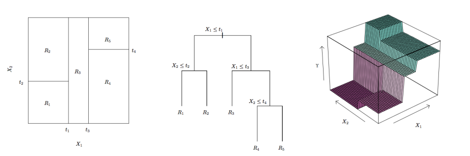

<!DOCTYPE html>
<html lang="" xml:lang="">
<head>

  <meta charset="utf-8" />
  <meta http-equiv="X-UA-Compatible" content="IE=edge" />
  <title>Nonparametric Smoothing</title>
  <meta name="description" content="Nonparametric Smoothing" />
  <meta name="generator" content="bookdown 0.44 and GitBook 2.6.7" />

  <meta property="og:title" content="Nonparametric Smoothing" />
  <meta property="og:type" content="book" />
  
  
  

  <meta name="twitter:card" content="summary" />
  <meta name="twitter:title" content="Nonparametric Smoothing" />
  
  
  

<meta name="author" content="David P. Hofmeyr" />

  <meta name="viewport" content="width=device-width, initial-scale=1" />
  <meta name="apple-mobile-web-app-capable" content="yes" />
  <meta name="apple-mobile-web-app-status-bar-style" content="black" />
  
  

<link href="libs/gitbook-2.6.7/css/style.css" rel="stylesheet" />
<link href="libs/gitbook-2.6.7/css/plugin-table.css" rel="stylesheet" />
<link href="libs/gitbook-2.6.7/css/plugin-bookdown.css" rel="stylesheet" />
<link href="libs/gitbook-2.6.7/css/plugin-highlight.css" rel="stylesheet" />
<link href="libs/gitbook-2.6.7/css/plugin-search.css" rel="stylesheet" />
<link href="libs/gitbook-2.6.7/css/plugin-fontsettings.css" rel="stylesheet" />
<link href="libs/gitbook-2.6.7/css/plugin-clipboard.css" rel="stylesheet" />

<link href="libs/anchor-sections-1.1.0/anchor-sections.css" rel="stylesheet" />
<link href="libs/anchor-sections-1.1.0/anchor-sections-hash.css" rel="stylesheet" />

</head>

<body>

  

    

      <nav role="navigation">

<ul class="summary">
<li class="chapter" data-level="1" data-path=""><a href="#nonparametric-smoothing"><i class="fa fa-check"></i><b>1</b> Nonparametric Smoothing</a>
<ul>
<li class="chapter" data-level="1.1" data-path=""><a href="#smoothing-as-local-averaging"><i class="fa fa-check"></i><b>1.1</b> Smoothing as Local Averaging</a></li>
<li class="chapter" data-level="1.2" data-path=""><a href="#decision-trees"><i class="fa fa-check"></i><b>1.2</b> Decision Trees</a></li>
</ul></li>
</ul>

      </nav>
    

    

      

        

          <h1>
            <i class="fa fa-circle-o-notch fa-spin"></i><a href="./">Nonparametric Smoothing</a>
          </h1>
        

        

          

            <section class="normal" id="section-">

<h1 class="title">Nonparametric Smoothing</h1>

<em>David P. Hofmeyr</em>

<h1>1 Nonparametric Smoothing</h1>

So far in all the models we have investigated there has been (at least implicitly) some <em>parameterised</em> structure. In the (generalised) linear models the regression coefficients and the distribution family used to model the response fully characterised the model(s). When we looked at basis expansions, even when we applied the kernel trick to bypass many of the calculations, within the feature space there was still the implicit setting of a set of optimal coefficients for the basis functions.

In this chapter we look at an alternative way of fitting models using what is known as <em>nonparametric smoothing</em>. We then go on to look at a very important group of models known as <em>Decision Trees</em> (DTs), which may be seen as combining the optimisation approach used in parametric models with the local averaging approach of nonparametric smoothing. DTs are highly nonlinear models yet despite this they can be highly interpretable. In addition DTs are by far the most popular models used within <em>ensemble</em> predictive models, which we cover in the next chapter.

<h2>1.1 Smoothing as Local Averaging</h2>

The appropriateness of estimating a function for prediction using a “local average” is most intuitively communicated from the point of view of regression. Recall that in the standard regression setting we have \[
Y = g^*(X) + \epsilon,
\] where the residual, \(\epsilon\), has mean zero.

<h3>1.1.1 Nearest Neighbours</h3>

<h4>1.1.1.1 Model Selection for <em>k</em>NN</h4>

<h2>1.2 Decision Trees</h2>

Decision trees also use the idea of a “local average” in order to fit predictive models, however instead of using a fixed “smoothing parameter” (like the \(k\) in \(k\)NN), they split up the input space into non-overlapping regions in a semi-optimal way; using the training data in order to choose how the splits are determined. They then use the averages from the training data in each of these regions in order to make predictions.

<ul>
<li>It is certainly possible to have more complex models within each of the regions than just choosing the average value, but this is beyond the scope of the course</li>
</ul>

The reason the models are referred to as decision <em>trees</em>, is that the partitioning of the covariate (input) space can be described in relation to a tree in the <em>graph theory</em> sense (don’t worry, you don’t have to know anything about graph theory). We can also think of them as trees in that, starting from a “root” <em>node</em>, observations are subjected to a rule/decision which results in a “branching” (splitting the observations based on the outcome of the rule/decision), after which the observations face another rule/decision which leads to further “branching”, and a further division of the input space, etc.

The following figure (taken from <em>Introduction to Statistical Learning</em>, James et al.) shows (left) a division of the two-dimensional space in \(X_1\) and \(X_2\) into five non-overlapping rectangular regions; (middle) a pictoral representation of the decisions/rules which lead to this partition (like an upside-down tree, with the root node at the top and the branches heading downwards); (right) the corresponding fitted function where the vertical direction shows the values the function assumes in each of the five regions.

<ul>
<li>If you choose a pair of values for \(X_1\) and \(X_2\) and then apply the rules in the tree in the middle figure above (starting from the top), following the left “branch” if the result of applying the rule is true and the right “branch” if it is false, until you reach one of the terminal nodes (called <em>leaves</em>), you will see that the tree representation agrees with the “flat” representation of the different regions in the left figure.</li>
</ul>

Notice that the rectangular regions into which a decision tree partitions the input space have their sides parallel with the variable axes. The reasons for this, as opposed to allowing diagonal splits, are (i) it is much more computationally efficient to fit trees in this way even if it may not lead to as good a fit to the data and (ii) the interpretation of the outputs of decision trees is made far simpler when each of the decisions/rules is based only on one of the variables.

<h3>1.2.1 Fitting and Pruning Decision Trees</h3>

As mentioned previously decision trees are fit in a semi-optimal manner. What this means is that the pairs of variables and <em>split points</em> which determine the different regions, are chosen in order to minimise a loss function. However the final fitted model is very far from guaranteed to contain the best possible splitting of the input space even if we are restricted to axis-parallel rectangles. The reason for this is that the <em>Classification And Regression Trees</em> (CART) algorithm uses a <em>greedy optimisation</em> approach in which the rules in the tree are determined sequentially, and once a rule/split is added it cannot be removed. That is, first the pair of covariate and split point for the root node is chosen, and then it is kept fixed as the next splits are chosen, which are then fixed, and the next are chosen, etc.

Let’s suppose we have the regions in a tree denoted as \(\R_1, ..., \R_R\), and for any potential vector of covariates, \(\x\), let’s write \(\R(x)\) to be the region into which \(\x\) falls. Since there is a single fixed value predicted in each region (determined from the averages of the responses from the points falling in these regions), we can write the training error as
\[
\frac{1}{n}\sum_{i=1}^n L(y_i, \hat y_{\R(\x_i)}),
\]
where \(\hat y_{\R}\) is the fitted value in region \(\R\). But since \(\hat y_{\R(\x)}\) is the same for all \(\x \in \R\) we can also write this as

\[
\frac{1}{n}\sum_{r=1}^R \sum_{i:\x_i \in \R_r} L(y_i, \hat y_{\R_r}).
\]
In other words the training error can be split into the errors/losses from each of the regions/leaf nodes in the tree. The total loss from a leaf node is often referred to as the <em>impurity</em> of the node. When choosing which split to add next during the sequential fitting of a tree, then, one just needs to find the region whose impurity can be improved the most by splitting it into two new regions.

It should be clear that as more and more splits/regions are added to a tree, the resulting model will be able to fit better and better to the training data. Indeed if eventually every single point is in its own leaf node, then the training error will be zero. We know that fitting too well to the training data will very likely lead to overfitting and poor generalisation performance. The simplest approach for limiting the complexity of a decision tree is simply to terminate the sequential splitting either when a maximum number of leaf nodes is reached, or the <em>depth</em> (the maximum number of rules/splits taken from the root node to any leaf node) reaches some chosen maximum. Given our understanding of how regularisation can be used to fit models with good generalisation, an alternative is to use a penalised objective function
\[
\frac{1}{n}\sum_{r=1}^R \sum_{i:\x_i \in \R_r} L(y_i, \hat y_{\R_r}) + \lambda R.
\]
In the above \(R\) is simply the number of splits/leaves/regions, and the penalty for increasing the complexity of the tree by adding an additional split is fixed equal to \(\lambda\). That is, there is no fixed maximum number of regions, and new regions can be added provided they improve the fit (i.e. reduce the training error) by at least \(\lambda\).

But here we reach a potential problem which comes about as a result of the <em>semi</em>-optimal manner in which trees are fit. What if by adding a “not-so-great” split fairly high up in the tree one is able to find a subsequent split which massively improves the overall fit? It is certainly possible that the high quality second split is not possible until the “not-so-great” split is added. A way around this is known as <em>pruning</em>. First a very deep/complex tree is fit, and then some of the branches are “pruned away” leaving a simpler tree in its place which gives a better penalised objective value. In this way it is possible to add the combination of a “not-so-great” split followed by a fantastic split instead of two mediocre splits (and, of course, more complex combinations of splits of varying quality).

In the context of what is known as <em>cost-complexity pruning</em> the penalty parameter \(\lambda\) is often referred to as the <em>complexity parameter</em>, and this can simply be chosen using our ubiquitous cross validation.

<h4>1.2.1.1 Regression Trees</h4>

Describing regression trees, given the above and what we already know about the standard regression problem, is relatively straightforward. As before a natural loss function to use when fitting regression trees is the squared error loss function, and we also learned when looking at likelihood based estimation in generalised linear models that minimising the squared error is equivalent to maximum likelihood when the response is normally distributed, i.e. when \(Y = g^*(X) + \epsilon\) where \(\epsilon \sim N(0, \sigma_{\epsilon}^2)\).

The squared error loss function is also computationally preferred in the context of decision trees since when scanning over the potential splits along one of the covariate axes calculation of the total loss can be done recursively.

<strong>Regression Trees in R</strong>

The <code>caret</code> package can be used to fit (and tune) decision trees, however we will also be making use of the <code>rpart</code> package. We will also use the package <code>rpart.plot</code> which provides nice visualisations of fitted decision trees.

<pre class="sourceCode r"><code class="sourceCode r">### Start by loading the libraries we need
library(ISLR2)
library(rpart)

### Let&#39;s quickly inspect
dim(Hitters)</code></pre>

<pre><code>## [1] 322  20</code></pre>

Similar to the function <code>train</code> in <code>caret</code> the <code>rpart</code> function uses a “control” object which tells it how to perform fitting and pruning. For starters we will simply use a fixed complexity parameter (<code>cp</code>) and set the minimum number of observations allowed in any terminal node (<code>minbucket</code>).

<pre class="sourceCode r"><code class="sourceCode r">### Set up the control object
contr &lt;- rpart.control(minbucket = 10, cp = 0.001)

### Now we can fit our model, setting the seed to ensure
### reproducibility
set.seed(123)
tree_model &lt;- rpart(log(Salary)~., data = Hitters, control = contr)</code></pre>

By default when calling the <code>rpart</code> function cross validation is performed and the results for all complexity parameters greater than the value provided are stored. The cross validation results can be seen by using the function <code>plotcp</code>:

<pre class="sourceCode r"><code class="sourceCode r">plotcp(tree_model)</code></pre>

The presentation of the results is slightly different from what we see from <code>caret</code>, where the <em>Relative Error</em> is shown representing the estimated prediction error relative to the model with no splits (i.e. one which simply uses the average in the entire data set). The horizontal dotted line also indicates the “one standard error rule” threshold. All relevant information is stored in the field <code>$cptable</code>, where the column <code>xerror</code> is the cross validation estimate of relative error and <code>rel error</code> is the <em>training</em> relative error:

<pre class="sourceCode r"><code class="sourceCode r">tree_model$cptable</code></pre>

<pre><code>##             CP nsplit rel error    xerror       xstd
## 1  0.568937909      0 1.0000000 1.0072170 0.06567495
## 2  0.061287729      1 0.4310621 0.4722220 0.05346809
## 3  0.057784443      2 0.3697744 0.4657209 0.05537989
## 4  0.030786188      3 0.3119899 0.3964910 0.06113039
## 5  0.013096781      4 0.2812037 0.3513748 0.06089676
## 6  0.011700767      5 0.2681069 0.3745273 0.05898447
## 7  0.010933909      6 0.2564062 0.3691529 0.05819627
## 8  0.009209713      7 0.2454723 0.3698248 0.05808903
## 9  0.008216401      8 0.2362626 0.3736554 0.05929000
## 10 0.005492546      9 0.2280462 0.3898444 0.06430554
## 11 0.005158254     10 0.2225536 0.3828877 0.06503018
## 12 0.003910817     11 0.2173954 0.3901558 0.06991258
## 13 0.003753955     12 0.2134845 0.3914650 0.06991046
## 14 0.003390561     13 0.2097306 0.3914650 0.06991046
## 15 0.001000000     14 0.2063400 0.3974447 0.07122065</code></pre>

To extract a model for a different setting of <code>cp</code> after fitting a first tree with <code>rpart</code> one can use the function <code>prune</code>. For example, for the values of <code>cp</code> which minimise the estimated prediction error and using the 1 standard error rule

<pre class="sourceCode r"><code class="sourceCode r">### Minimum cv error
ix_min &lt;- which.min(tree_model$cptable[,&#39;xerror&#39;])
cp_min &lt;- tree_model$cptable[ix_min,&#39;CP&#39;]

pruned_tree_min &lt;- prune(tree_model, cp = cp_min)

### One standard error rule
ix_1se &lt;- min(which(tree_model$cptable[,&#39;xerror&#39;] &lt;= tree_model$cptable[ix_min,&#39;xerror&#39;] +
                      tree_model$cptable[ix_min,&#39;xstd&#39;]))
cp_1se &lt;- tree_model$cptable[ix_1se,&#39;CP&#39;]

pruned_tree_1se &lt;- prune(tree_model, cp = cp_1se)</code></pre>

<strong>Visualising and Interpreting Decision Trees</strong>

One of the reasons decision trees are favoured by practicioners is the fact that they can very clearly and intuitively be visualised, provided they are not very complex. Let’s investigate the trees we fit above to the <code>Hitters</code> data set using the <code>prp</code> function in the <code>rpart.plot</code> package.

<pre class="sourceCode r"><code class="sourceCode r">### Load the package
library(rpart.plot)

### The two trees selected using cross validation
par(mfrow = c(1, 2))
prp(pruned_tree_min, main = &quot;Tree selected by minimum CV error&quot;)

prp(pruned_tree_1se, main = &quot;Tree selected by 1 SE rule&quot;)</code></pre>

<ul>
<li>It is hopefully not surprising that the model selected using the one standard error rule is simpler than the one which gave the lowest cross validation error estimate.</li>
</ul>

Both trees clearly indicate how the predictions from the two models come about. For example, in the left tree we can see that the key determining factors (as captured by this model) in achieving the highest predicted salary (bottom right leaf of the tree) is to have variable <code>CAtBat</code> (number of times batting in entire career) at least 1452, <code>Hits</code> (total number of hits in the year 1986) at least 118, and <code>CRBI</code> (total number of runs scored in career) at least 273. None of the other variables affects <em>this particular</em> prediction, but the number of career hits <code>CHits</code> is an important variable for prediction when <code>CAtBat</code> is less than 1452.

The fact that different variables become more/less important depening on splits higher up the tree mean that decision trees are extremely well suited to capturing complex interactions between covariates. However, as alluded to above, being able to interpret the outputs of a tree model relies on its not being too complex. If we consider the original tree we fit, we see something less appealing

<pre class="sourceCode r"><code class="sourceCode r">prp(tree_model, main = &quot;Tree with default cp = 0.001&quot;)</code></pre>

Although with only 320 observations and a minimum node size of 10 one cannot ever reach extreme levels of complexity, already in this model interpretation becomes more challenging than in the pruned models.

<h4>1.2.1.2 Classification Trees</h4>

<h3>1.2.2 Interpreting Decision Trees</h3>

<h3>1.2.3 Cost Complexity Pruning</h3>

<h3>1.2.4 Some further Comments on Decision Trees</h3>
<ul>
<li>
Handle combinations of categorical and continuous covariates well (where categorical variables are often tricky to handle for nonparametric models)
</li>
<li>
Handle missing data directly!
</li>
<li>
Instability!
</li>
</ul>

            </section>

          

        

      

    

  

<!-- dynamically load mathjax for compatibility with self-contained -->

</body>

</html>
